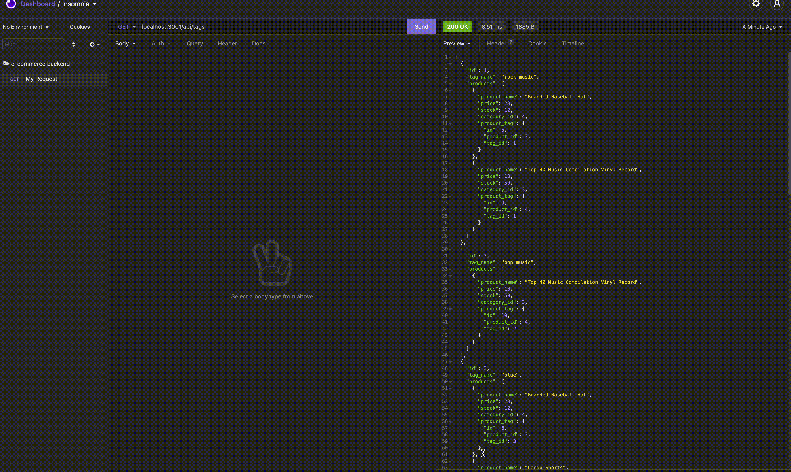
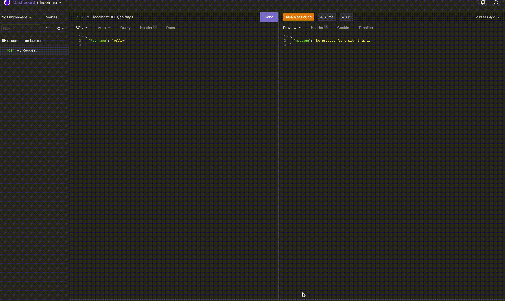

# E-Commerce Backend
[](https://opensource.org/licenses/MIT)

## Description
A mysql database and application backend for an e-commerce site. Built using MySQL2, Express, Sequelize and dotenv.

## Contents
- [Installation](#installation)
- [Usage](#usage)
- [Demo](#demo)
- [Built With](#built-with)
- [Questions](#questions)
- [Credits](#credits)

## Installation
To install all the dependencies, use the command below

```
npm  install express mysql2 sequelize dotenv
```

## Usage
To use this application, clone the repository to your local machine:
```
git clone https://github.com/lisahuele/e-commerce-backend.git
```

Then, ensure you have installed the dependencies with the command.

When you are ready to run the application, from the root directory, type the command:

```
mysql -u root -p
```

Enter PW when prompted

`source db/schema.sql`
`quit`
`npm run seed`
`npm start`

## Demo

### Setup and Start


### GET all


### GET by ID


### POST, PUT, DELETE Categories


### POST, PUT, DELETE Products


### POST, PUT, DELETE Tags


## Built With
- Express.js
- MYSQL2
- Sequelize
- dotenv

## Questions
If you have any questions about the repo, please contact me via email at lisahuele@gmail.com. You can find more of my work on my GitHub, [lisahuele](https://github.com/lisahuele).

## Credits
Created by Lisa Le.
